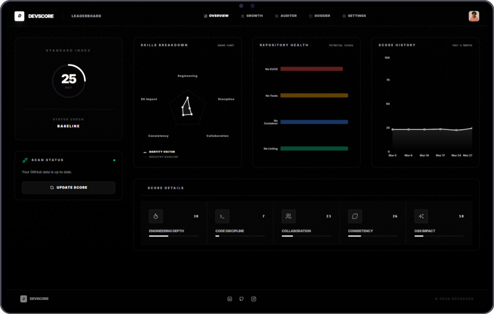

# DEVSCORE



**Developer Intelligence Platform**

DevScore is an AI-powered platform that analyzes GitHub repositories to generate structured engineering tiers. It evaluates code quality, architectural decisions, contribution consistency, and technical depth to produce measurable developer insights.

---

## Overview

DevScore connects to a developer’s GitHub account, audits repositories using an AI-driven evaluation pipeline, and assigns standardized engineering levels. The system emphasizes objective metrics across architecture, discipline, and long-term contribution patterns.

The result is a quantified score breakdown and shareable “DevScore Dossier” badges for portfolios and public profiles.

---

## Features

- **GitHub OAuth Integration**  
  Secure authentication and repository synchronization.

- **AI-Driven Repository Audit**  
  Architectural and structural analysis powered by Groq (Llama 3.3 70B).

- **Scoring Framework**  
  Automated evaluation across:
  - Depth
  - Discipline
  - Consistency

- **DevScore Badges**  
  Dynamically generated, embeddable credibility indicators.

- **Professional Interface**  
  Dark and light themes built with React and Framer Motion.

---

## Technology Stack

### Frontend
- React
- Vite
- Tailwind CSS
- Recharts

### Backend
- Django 5
- Django REST Framework
- PostgreSQL

### Asynchronous Processing
- Django Background Tasks

### AI Engine
- Groq API (Llama 3.3 70B)

### Infrastructure
- Docker Compose
- Koyeb (Backend Hosting)
- Vercel (Frontend Hosting)
- Neon PostgreSQL (Managed Database)

---

## Quick Start

### 1. Environment Setup

Clone the repository and create your environment file:

```bash
cp .env.example .env